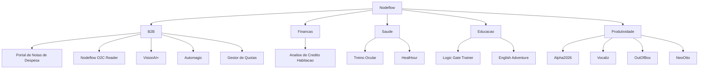
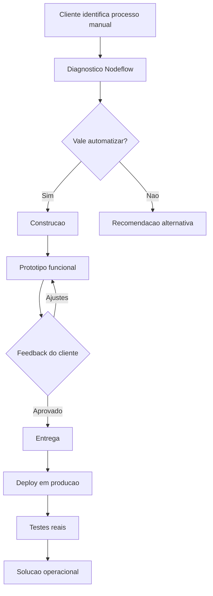
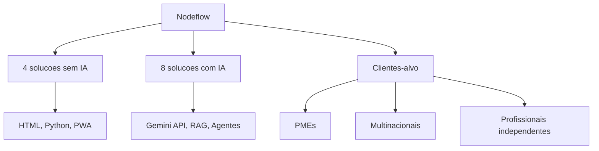
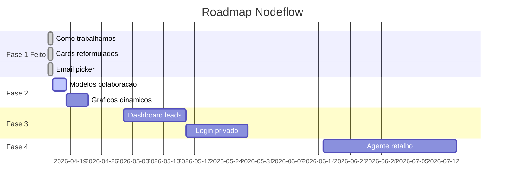

# Nodeflow · Diagramas Mermaid

---

## 1 · Portfolio

```mermaid
graph TD
    NF[Nodeflow] --> B2B
    NF --> FIN[Financas]
    NF --> SAU[Saude]
    NF --> EDU[Educacao]
    NF --> PRD[Produtividade]

    B2B --> A1[Portal de Notas de Despesa]
    B2B --> A2[Nodeflow O2C Reader]
    B2B --> A3[VisionAI+]
    B2B --> A4[Automagic]
    B2B --> A5[Gestor de Quotas]

    FIN --> B1[Analise de Credito Habitacao]

    SAU --> C1[Treino Ocular]
    SAU --> C2[HealHour]

    EDU --> D1[Logic Gate Trainer]
    EDU --> D2[English Adventure]

    PRD --> E1[Alpha2026]
    PRD --> E2[Vocaliz]
    PRD --> E3[OutOfBox]
    PRD --> E4[NeoOtto]
```

---

## 2 · Processo

```mermaid
graph TD
    A[Cliente identifica processo manual] --> B[Diagnostico Nodeflow]
    B --> B1{Vale automatizar?}
    B1 -->|Sim| C[Construcao]
    B1 -->|Nao| Z[Recomendacao alternativa]
    C --> C1[Prototipo funcional]
    C1 --> C2{Feedback do cliente}
    C2 -->|Ajustes| C1
    C2 -->|Aprovado| D[Entrega]
    D --> D1[Deploy em producao]
    D1 --> D2[Testes reais]
    D2 --> D3[Solucao operacional]
```

---

## 3 · Arquitectura de Negocio

```mermaid
graph TD
    NF[Nodeflow] --> S1[4 solucoes sem IA]
    NF --> S2[8 solucoes com IA]
    NF --> S3[Clientes-alvo]

    S1 --> T1[HTML, Python, PWA]
    S2 --> T2[Gemini API, RAG, Agentes]

    S3 --> P1[PMEs]
    S3 --> P2[Multinacionais]
    S3 --> P3[Profissionais independentes]
```

---

## 4 · Roadmap

```mermaid
gantt
    title Roadmap Nodeflow
    dateFormat YYYY-MM-DD
    section Fase 1 Feito
        Como trabalhamos      :done, 2026-04-14, 1d
        Cards reformulados    :done, 2026-04-14, 1d
        Email picker          :done, 2026-04-14, 1d
    section Fase 2
        Modelos colaboracao   :active, 2026-04-15, 3d
        Graficos dinamicos    :2026-04-18, 5d
    section Fase 3
        Dashboard leads       :2026-05-01, 14d
        Login privado         :2026-05-15, 14d
    section Fase 4
        Agente retalho        :2026-06-15, 30d
```
